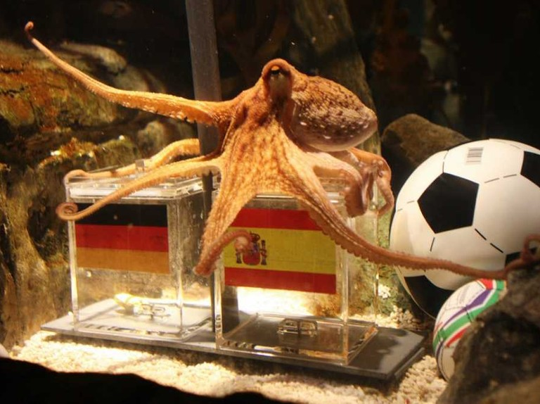

<a href="https://github.com/bacembendaly99/octopus-predictions-frontend" target="_blank">click to view the front-end repository </a>

<a href="https://github.com/achourali/octopus-predictions-data-mining" target="_blank">click to view the data-mining repository </a>

# Octopus Predictions Backend 🐙🐙

Octopus Predictions is a Website where you can find the best predictions for sports results 🧾

The name is inspired from Paul the famous octopus of the world cup 2010 

